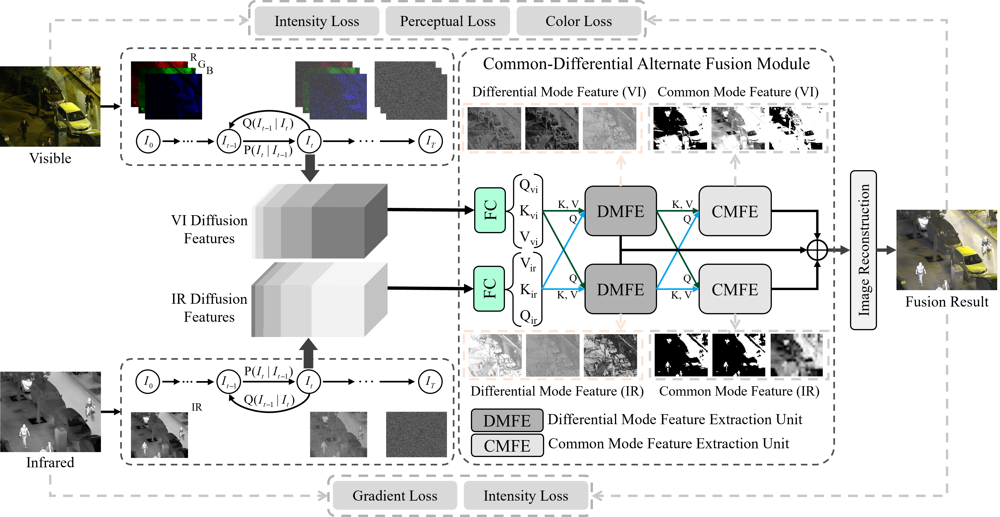

# Dif-CDFusion: Bridging Spectral Fidelity and Structural Detail in Infrared-Visible Image Fusion

This repository contains the official implementation of the paper ​**"Bridging Spectral Fidelity and Structural Detail: A Diffusion-Based Common-Differential Fusion Network for Infrared-Visible Images"**, which has been submitted to ​**IEEE Transactions on Geoscience and Remote Sensing (TGRS)**.

## Abstract
Infrared and visible image fusion aims to enhance scene representation by integrating complementary sensor data. However, existing methods fail to reconcile spectral fidelity with structural consistency. For one thing, grayscale fusion approaches preserve structural details by discarding color information, inherently sacrificing spectral fidelity. For another, color fusion techniques maintain spectral authenticity but compromise details and structural consistency due to the misaligned chromatic information. To bridge the gap, we present the ​**Dif-CDFusion**, which resolves the conflict between spectral fidelity and the preservation of structural details through diffusion-based feature extraction and common-differential alternating feature fusion. By individually constructing a denoising diffusion process in latent space to model multi-channel spectral distributions, our approach extracts diffusion features that preserve color integrity while capturing complete spectral information for texture retention. Subsequently, we design a common-differential alternate fusion module to alternately integrate differential and common mode components within diffusion features, enhancing both structural details and thermal target salience. Extensive experiments demonstrate that our ​**Dif-CDFusion** achieves state-of-the-art performance both quantitatively and qualitatively.

## Method Framework
Below is the framework of our proposed ​**Dif-CDFusion**:


## Datasets
The following datasets are used in our experiments:
- ​**TNO**: [Download](https://figshare.com/articles/dataset/TNO_Image_Fusion_Dataset/1008029)
- ​**INO**: [Download](https://www.ino.ca/en/technologies/video-analytics-dataset/videos/)
- ​**RoadScene**: [Download](https://github.com/hanna-xu/RoadScene)
- ​**MSRS**: [Download](https://github.com/Linfeng-Tang/MSRS)
- ​**LLVIP**: [Download](https://bupt-ai-cz.github.io/LLVIP/)
- ​**M3FD**: [Download](https://github.com/JinyuanLiu-CV/TarDAL)
- ​**VEDAI**: [Download](https://downloads.greyc.fr/vedai/)

## Pretrained Weights
Pretrained weights for our model can be downloaded from [here](pretrained_weights_link).

## Usage
To train or evaluate the model, follow these steps:
1. Clone this repository:
   ```bash
   git clone https://github.com/your_username/Dif-CDFusion.git
   cd Dif-CDFusion
